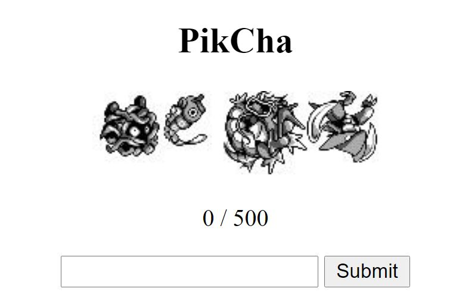
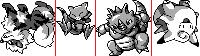
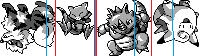
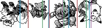

# UMass CTF 2021 Pikcha Writeup

## Pikcha
### Details
Solves: 153

### Writeup
Logging onto the challenge website, we're greeted with this screen: 



When you hit submit, the image changes to a new set of randomly rotated pokemon. From inspection, putting the four pokedex numbers of the pokemon in order incremented the 0/500 to 1/500. Any wrong inputs makes it go back down to 0. I didn't want to sit there entering pokedex numbers for a couple hours, so I looked around the site to see if anything else was vulnerable. The HTML looked fine, but I found a cookie being stored:

```
session = eyJhbnN3ZXIiOls1OSw1OSwxMjksMTQ4XSwiY29ycmVjdCI6MCwiaW1hZ2UiOiIuL3N0YXRpYy9jaGFsbC1pbWFnZXMvSlFBT3lUckx2dy5qcGcifQ.YGEO1w.alLsGJMLYwQBrc6ZKH3xrhhSTps
```

It seemed like it was base64 encoded, and sure enough after decoding we got:

```
session = {"answer":[59,59,129,148],"correct":0,"image":"./static/chall-images/JQAOyTrLvw.jpg"}ípjRì“c­Î™(}ñ®RN›
```

Initially, I tried just setting `correct` to 500, but that seemed to result in errors, so I switched focus to the `answer` array. And sure enough, the four numbers given were the correct input for the given image. With this information it was pretty easy to write a script to extract the answer from the cookie and submit it:

```
url = "http://104.197.195.221:8084/"
r = requests.get(url)
cookie = r.cookies.items()[0][1]
cookie = cookie.split(".")[0].encode('ascii') + b'==='
ans = json.loads().decode('ascii'))["answer"]
ans = str(ans[0]) + " " + str(ans[1]) + " " + str(ans[2]) + " " + str(ans[3])
data = {'guess': ans}
r = requests.post(url, data=data, cookies = r.cookies)
```

Do this 500 times, and you get the flag from the request: `UMASS{G0tt4_c4tch_th3m_4ll_17263548}`

## Pikcha2
### Details
Solves: 10

No more mistakes! No we'll see who's the best pokemon master out there!

### Writeup
Logging into the site this time we're greeted with the same thing:


This time, however, the cookie isn't useful:

```
session = c21573b6-c453-4857-bf4a-fc29225fadc1
```

This looks like a [uuid](https://docs.python.org/3/library/uuid.html), which isn't going to be of any help to us. I probably could've dome some more inspection, but there was discussion on the discord about how the only 2 ways to solve this challenge was computer vision and by hand, so I decided to try out the CV route. First, we have to extract the image from the web page. This could be done pretty easily by recycling our old code. The HTML was pretty simple, so I just searched through the html text as a string to find the path to the image, and downloaded it:

```
url = "http://104.197.195.221:8085/"
r = requests.get(url)
img_path = r.text[r.text.find('./static/chall-images')+2:(r.text.find('.jpg')+4)]
img_url = url + img_path
img_data = requests.get(img_url).content
with open('img.jpg', 'wb') as handler:
    handler.write(img_data)
```

Which gives us the image:


Next up, in order to actually analyze the pokemon images we had to split them into their own images. I did this by just cutting the image into 4 parts horizontally:

```
img = cv2.imread('img.jpg', cv2.IMREAD_GRAYSCALE)
im_x = img.shape[1]
im_y = img.shape[0]

cut1 = int(im_x/4)
cut2 = int(im_x/2)
cut3 = int(3*im_x/4)

p1 = img[0:im_y, 0:cut1]
p2 = img[0:im_y, cut1:cut2]
p3 = img[0:im_y, cut2:cut3]
p4 = img[0:im_y, cut3:im_x]

mon = [p1, p2, p3, p4]
```

To identify the pokemon, I decided to use opencv's built in feature matching software. Specifically, SIFT to identify features and FLANN to match the features between images. I got the set of images from [this helpful website](https://veekun.com/dex/downloads) which had sprite packs of all the gen 1-5 games. After comparing sprites, I found that the ones being used were from gen 1 (Pokemon Crystal). The images were already labeled by pokedex number, so all I had to do was match the given pokemon to it's corresponding image! I wrote a quick script then that initialzes SIFT and FLANN, and identifies matching features for a given image pair:

```
#grab the sprite of the ith pokemon
cmpp = cv2.imread("1.png")
kp1, des1 = sift.detectAndCompute(p,None)
kp2, des2 = sift.detectAndCompute(cmpp,None)
FLANN_INDEX_KDTREE = 1
index_params = dict(algorithm = FLANN_INDEX_KDTREE, trees = 7)
search_params = dict(checks=50)   # or pass empty dictionary
flann = cv2.FlannBasedMatcher(index_params,search_params)
matches = flann.knnMatch(des1,des2,k=2)
matches_num = 0
for k,(m,n) in enumerate(matches):
    if m.distance < 0.7*n.distance:
        matches_num += 1
```

With this, we can iterate over all the pokemon sprites, and find the one that has the highest amount of matching features. That would be the correct pokemon. Doing this for each pokemon image given would allow us to get the correct input.

```
#Loop for each pokemon
    for j, p in enumerate(mon):
        pmatches = [None]*151
        # Loop for each gen 1 pokemon to compare against
        for i in range(151):
            #grab the sprite of the ith pokemon
            cmpp = cv2.imread("gray/" + str(i+1) + ".png")
            
            # find the keypoints and descriptors with SIFT
            kp1, des1 = sift.detectAndCompute(p,None)
            kp2, des2 = sift.detectAndCompute(cmpp,None)

            # FLANN parameters
            FLANN_INDEX_KDTREE = 1
            index_params = dict(algorithm = FLANN_INDEX_KDTREE, trees = 7)
            search_params = dict(checks=50)   # or pass empty dictionary
            flann = cv2.FlannBasedMatcher(index_params,search_params)
            matches = flann.knnMatch(des1,des2,k=2)

            matches_num = 0
            # ratio test as per Lowe's paper
            # if the feature passes the test, we consider the a match and increment the number of matches
            for k,(m,n) in enumerate(matches):
                if m.distance < 0.7*n.distance:
                    matches_num += 1
            pmatches[i] = matches_num
            
        # Find the pokemon that had the highest number of matches, and get it's pokedex number
        pnums[j] = pmatches.index(max(pmatches))+1

    # Construct our guess and the response
    ans = str(pnums[0]) + " " + str(pnums[1]) + " " + str(pnums[2]) + " " + str(pnums[3])
    data = {'guess': ans}
    r = requests.post(url, data=data, cookies = r.cookies)
    print(b, "guess:", ans)
```

I set the program to run, and it actually worked! I was surprised that the feature matching worked so well out of the box. However, I noticed that after about 40-50 or so succesful submissions, the guess would fail. After some investigation, it seemed that the matching was failing for some of the smaller pokemon (diglett, poliwag, horsea). When I split the image up, it seemed that it wasn't splitting it perfectly for the smaller pokemon, and some of the other pokemon were cropped into their image. Initially, I tried replacing those pokemon's image in with the one that I had extracted from the challenge, but that only seemed to provide temporary stability. The main problem was that for some reason, the images were variable width. I had figured that each sprite would have the same footprint, regardless of size, but they actually change size. This is especially apparent for the smaller pokemon. Thus, when I split the image into quarters, I was cutting off certain pokemon and adding clutter to other images. To fix this, I wanted to detect the vertical whitespace between the pokemon:



Because the image was noisy, I had to settle for finding the maximum amount of whitespace. I did this by summing the pixels vertically (I subtracted the values in the images to make it easier for me to read). I also had to specify where to look for these strips:
 
```
vert_sum = [sum(255 - img[0:im_y, x]) for x in range(im_x)]
cut = [0, None, None, None, im_x]

# Calculate the regions to look for the maximum whitespace strip
cut_off1 = int(im_x/8)
cut_off2 = int(3*im_x/8)
cut_off3 = int(5*im_x/8)
cut_off4 = int(7*im_x/8)

cut[1] = vert_sum[cut_off1:cut_off2].index(min(vert_sum[cut_off1:cut_off2])) + cut_off1
cut[2] = vert_sum[cut_off2:cut_off3].index(min(vert_sum[cut_off2:cut_off3])) + cut_off2
cut[3] = vert_sum[cut_off3:cut_off4].index(min(vert_sum[cut_off3:cut_off4])) + cut_off3
```

However, this actually decreased accuracy. This is because it's susceptable to the same problem I was trying to solve; If there's an especially small pokemon, the regions that I'm looking for will shift, resulting in strips of 1-pixel wide whitespace being selected as a pokemon. I've drawn an exaggerated example below, where the blue lines are the region boundaries, and the red lines are the selected cut points:



The easiest fix I saw to this was to just recalculate the border points every time you cut the image. I've drawn another exaggerated example below, where the blue lines are the original borders, the green are the borders after the first cut, and the purple are the borders after the second cut.



```
# Find the first cut point
cut_off1 = int(im_x/8)
cut_off2 = int(3*im_x/8)
cut[1] = vert_sum[cut_off1:cut_off2].index(min(vert_sum[cut_off1:cut_off2])) + cut_off1

# Recalculate the regions where we're looking for the cut points, and then find the second one
cut_off2 = int(1*(im_x-cut[1])/6) + cut[1]
cut_off3 = int(3*(im_x-cut[1])/6) + cut[1]
cut_off4 = int(5*(im_x-cut[1])/6) + cut[1]
cut[2] = vert_sum[cut_off2:cut_off3].index(min(vert_sum[cut_off2:cut_off3])) + cut_off2

# Recalculate the region again, and find the third cut point
cut_off3 = int(1*(im_x-cut[2])/4) + cut[2]
cut_off4 = int(3*(im_x-cut[2])/4) + cut[2]
cut[3] = vert_sum[cut_off3:cut_off4].index(min(vert_sum[cut_off3:cut_off4])) + cut_off3
```

This fix dramatically increased stability, and allowed us to complete all 500 rounds of the challenge, giving us the flag: `UMASS{1ts_m3_4nd_y0u!!P0k3m0n}`. I'm sure there was a better way to fix this last issue, and there's still a ton of tuning left to do to improve stability, but overall I'm happy with what I've learned.

